## FASM Editor
FASM Editor - редактор ASM кода, предназначен для удобства разработки, 
был разработана для себя и сообщества ассемблер программистов. 
Данная программа была написана на Delphi. 
В программе был реализован синтаксический анализатор, 
подсветка кода, авто-дополнение кода, 
генерация списка экспортируемых функций из DLL

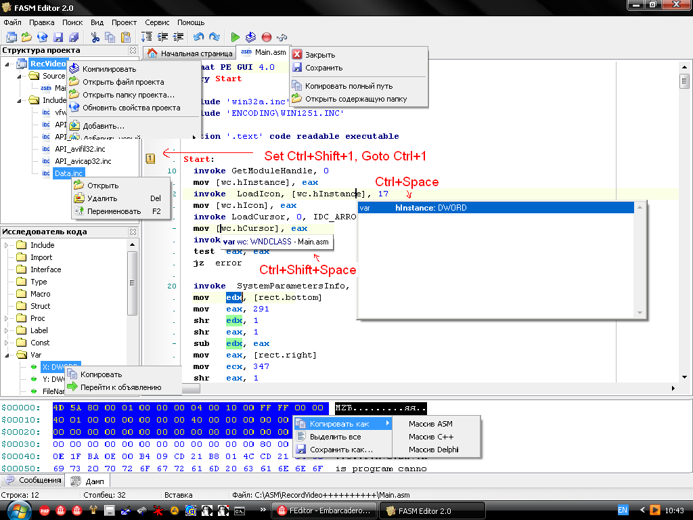

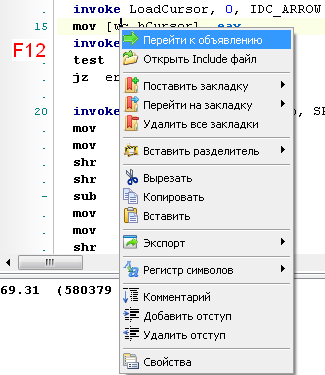

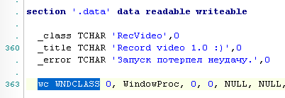

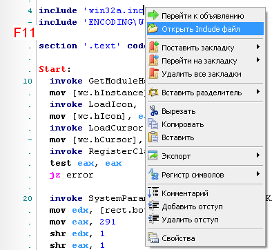

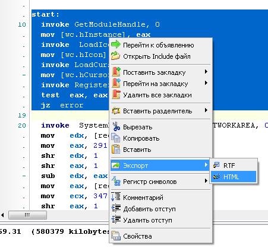

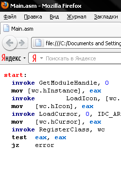

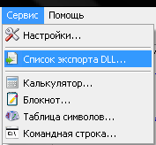

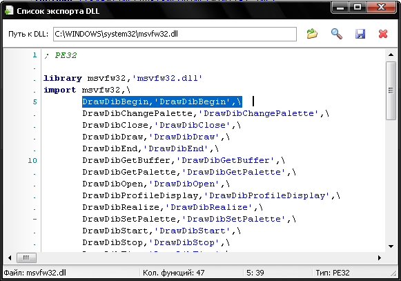

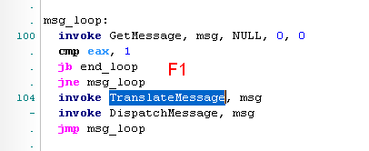

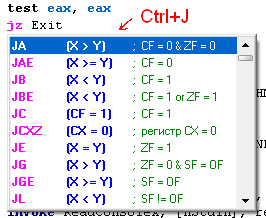

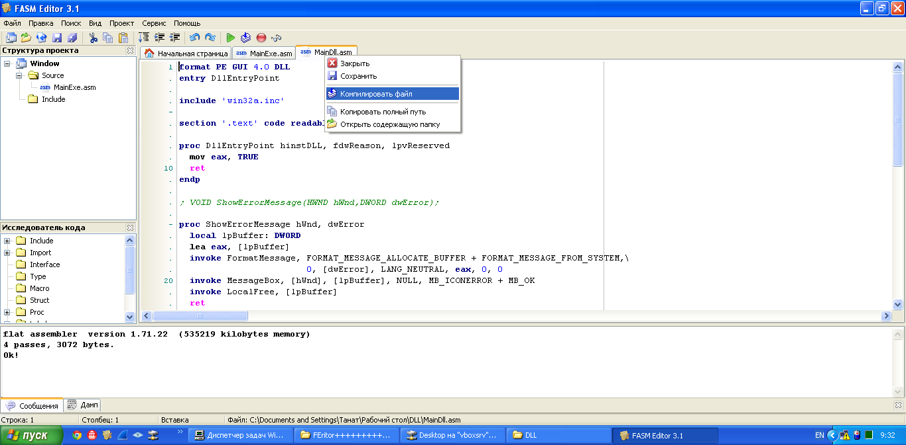

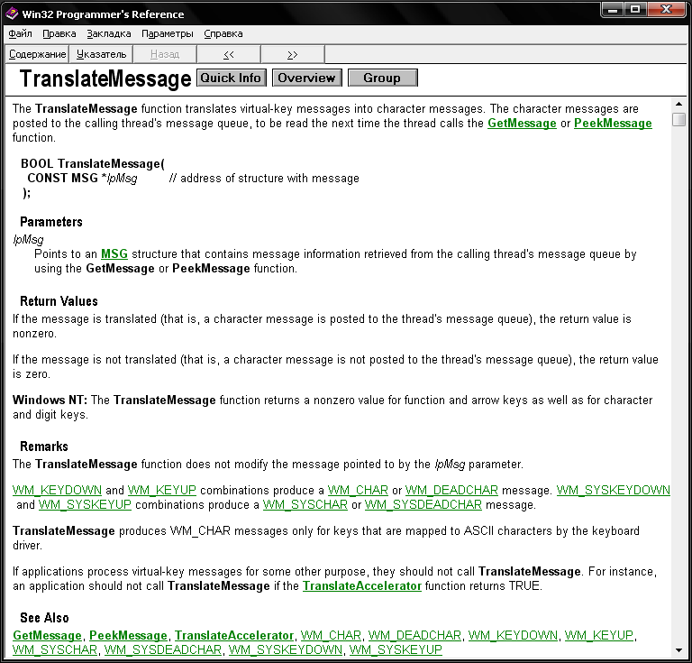
